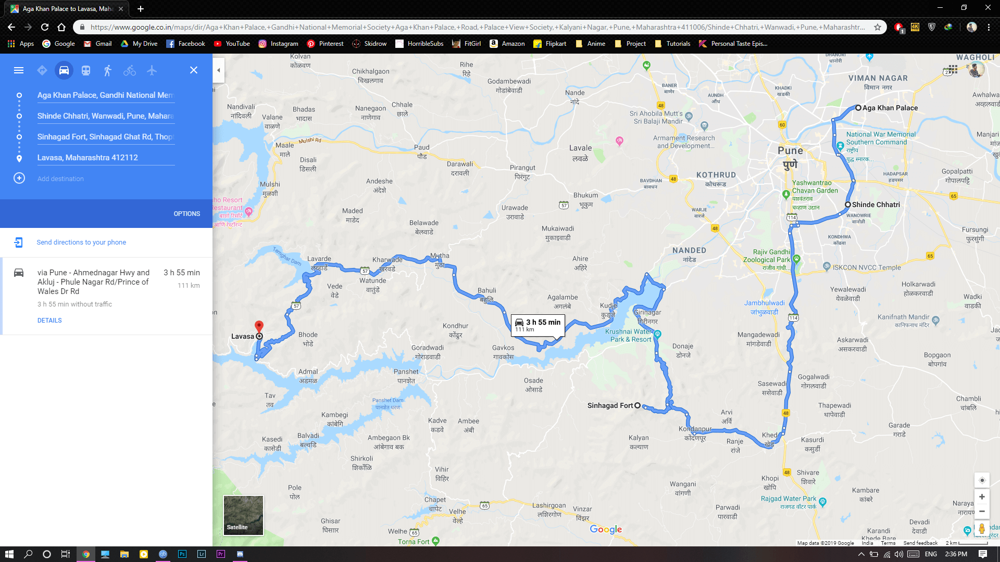
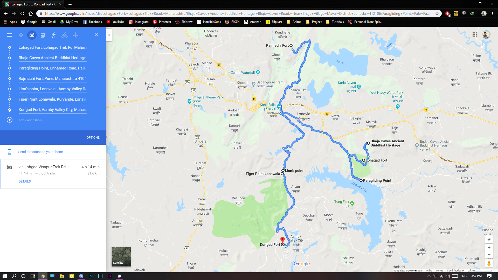
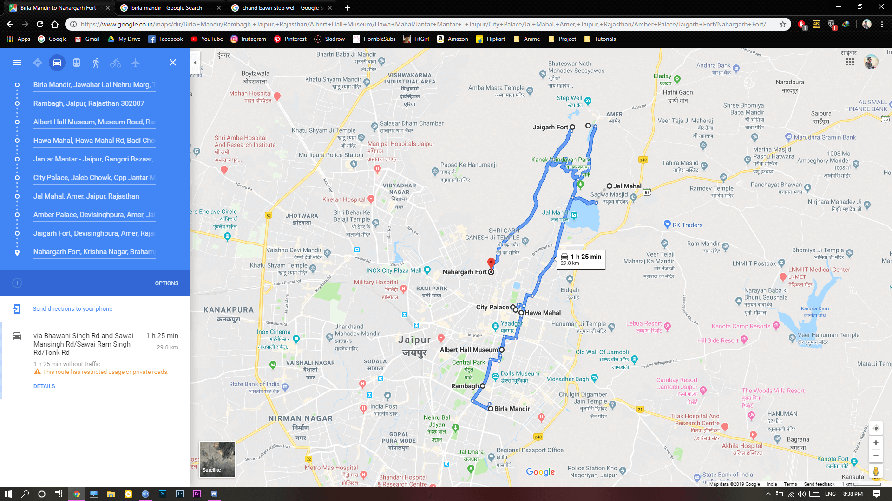
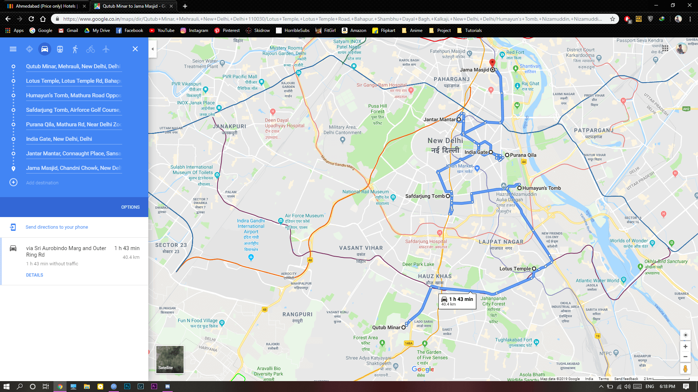
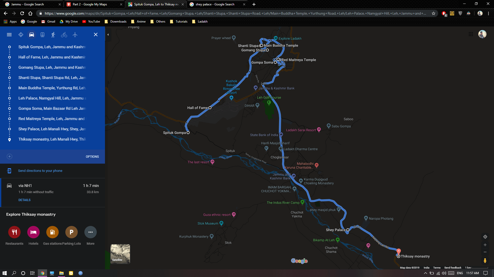
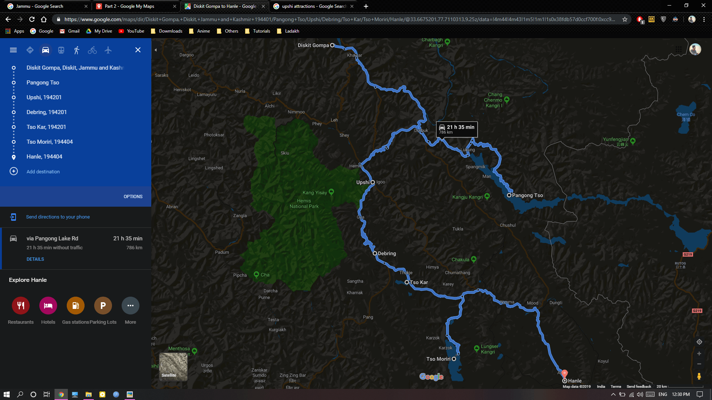
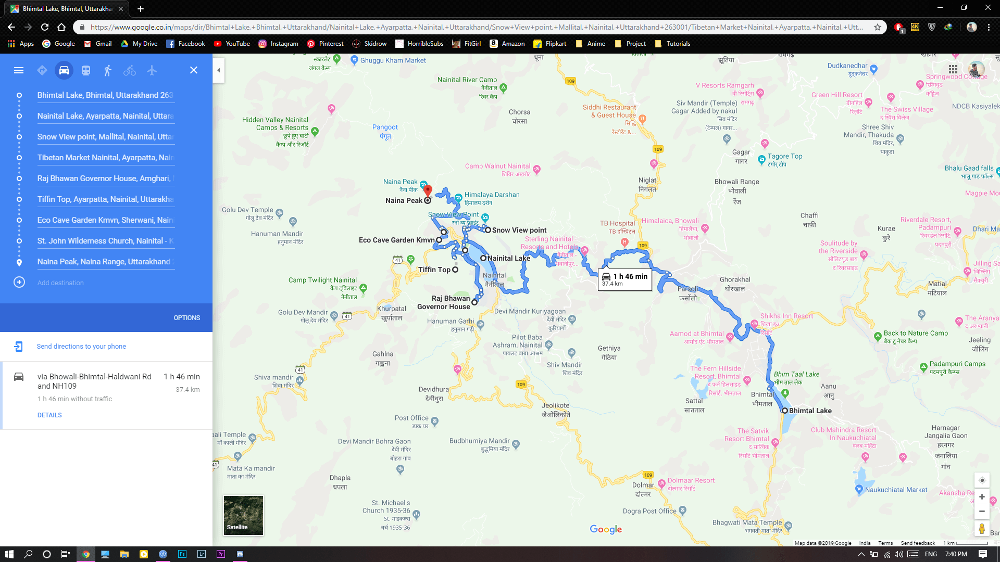
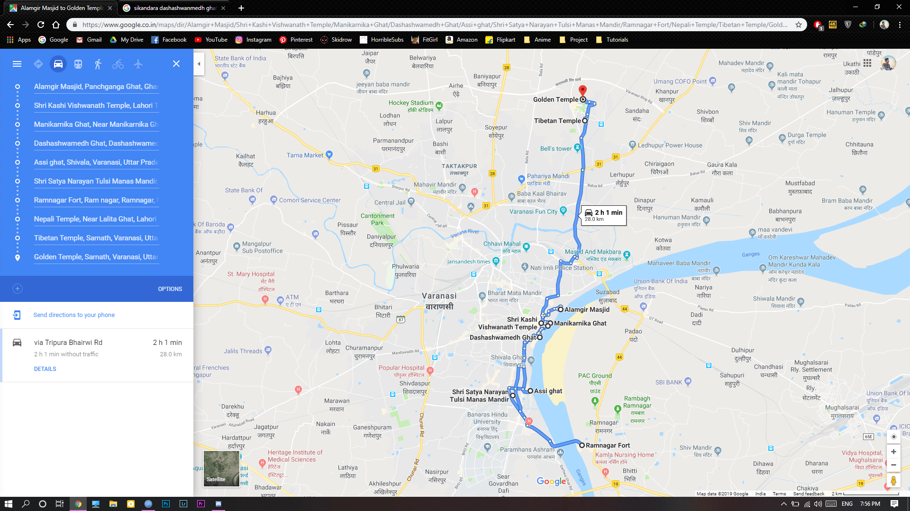

# Ladakh - The Trip

An epic ride featuring over 20 states in over 50 days.

## The Necessities

### Accessories

- Trekking Bag
- Light Travel Bag
- Saddle Bags
- Tank Bags
- Rain Covers
- Riding Jacket
- Helmet
- Gloves
- Kneepads
- Seat Cushion
- Bluetooth Intercom
- Helmet Lock Cable
- Bungee Cords
- Jerry Cans
- Nylon/Polyester Clothing
- Jeans/Cargoes
- Sandals
- 6x Socks
- Thermals
- Scarf
- Sunscreen
- Face Wash
- UV Sunglasses
- Shoes/Boots
- Umbrella
- Knife
- First Aid Kit
- Paper Map
- Book and Pen
- Brush

### Medicines & Consumables

- Diamox Tablets
- Headache Meds
- Vomitting Meds
- Diarrea Meds
- Balm
- Snickers
- Dry Fruits
- Water Bottles
- Toothpaste
- Soap
- Spray

### Motorcycle Mods

- Tyres (Pirelli Scorpion Rally STR)
- Bolt Charger
- Mobile Holder
- Saddle Stay
- Frame Slider
- Fork Slider
- Engine Bash Plate
- Aux Lights
- Blinker/Hazard

### Parts and Spares

- Clutch Cable
- Spark Plugs
- Puncture Kit
- Repair Toolkit
- Chain Lube
- Engine Oil
- Air Filter
- Coolant
- Brake Fluids
- Oil Filter
- WD40
- M-Seal
- Electric Tape
- Air Pump

### Gadgets

- GoPro
- GoPro Lenses/Filters
- GoPro Batteries
- GoPro Waterproof Casing
- 2x Mobilephones
- DSLR
- Tripod
- Headset
- Laptop
- SD Cards
- Hard Disk
- Power Banks
- Extension Cable
- Multipin Power Socket
- Flashlight

### Documents and other Necessities

- Duplicate Motorcycle Key
- Original RC
- Insurance
- Pollution Certificate
- Original License
- Original Aadhar
- Photostat Copies of above all
- 10 Passport Size Photos
- Airtel Postpaid Sim Card
- Contact details of 2 guardians/Important person
- Permits From Leh
- Copy Of Permits

## Route Maps

    
Thrissur - Udaipur

    

   

    
Udaipur - Amritsar

    

   

    
Amritsar - Turtuk

    

   

    
Turtuk - Shimla

    

   

    
Shimla - Puducherry

    

   

    
Puducherry - Thrissur

    

   

## Attractions

    
Goa

    

   

    
Mahabaleshwar

    

   

    
Pune

    

   

    
Lonavla

    

   

    
Mumbai

    

   

    
Vadodara

    

   

    
Ahmedabad

    

   

    
Gujarat

    

   

    
Udaipur

    

   

    
Jodhpur

    

   

    
Jaisalmer

    

   

    
Bikaner

    

   

    
Jaipur - 1

    

   

    
Jaipur - 2

    

   

    
Jaipur - 3

    

   

    
Agra

    

   

    
Delhi

    

   

    
Punjab

    

   

    
Amritsar

    

   

    
Dharamshala

    

   

    
Jammu

    

   

    
Srinagar

    

   

    
Kargil

    

   

    
Leh - 1

    

   

    
Leh - 2

    

   

    
Diskit

    

   

    
Debring

    

   

    
Keylong

    

   

    
Manali

    

   

    
Kasol

    

   

    
Shimla

    

   

    
Dehradun

    

   

    
Rishikesh

    

   

    
Nainital

    

   

    
Lucknow - 1

    

   

    
Lucknow - 2

    

   

    
Varanasi - 1

    

   

    
Varanasi - 2

    

   

    
Chattisgarh

    

   

    
Vishakapatanam

    

   

    
Hyderabad

    

   

    
Chennai

    

   

    
Puducherry

    

   

    
Dhanushkodi

    

   

    
Madurai

    

   

## The Plan

| Day  | Route                                  | Timings  | Comments |
|:----:|----------------------------------------|----------|----------|
| 1    | Thrissur - Bekal Fort - Goa            |          |          |
|      | Goa - Pune                             |          |          |
|      | Pune - Mumbai - Vadodara - Ahmedabad   |          |          |
|      | Ahmedabad - Gujarat - Jaisalmer        |          |          |
|      | Jaisalmer - Bikaner - Jodhpur          |          |          |
|      | Jodhpur - Jaipur                       |          |          |
|      | Jaipur - Agra - Delhi                  |          |          |
|      | Delhi - Ludhiana - Amritsar            |          |          |
|      | Amritsar - Dharamshala                 |          |          |
|      | Dharamshala - Jammu                    |          |          |
|      | Jammu - Srinagar                       |          |          |
|      | Srinagar - Gulmarg - Kargil            |          |          |
|      | Kargil - Zanskar - Leh                 |          |          |
|      | Leh - Khardung La - Diskit             |          |          |
|      | Diskit - Nubra Valley - Turtuk         |          |          |
|      | Turtuk - Shyok - Pangong Tso           |          |          |
|      | Pangong Tso - Upshi - Debring          |          |          |
|      | Debring - Tso Moriri - Hanle - Debring |          |          |
|      | Debring - Keylong                      |          |          |
|      | Keylong - Manali                       |          |          |
|      | Manali - Kasol - Mandi - Shimla        |          |          |
|      | Shimla - Rishikesh                     |          |          |
|      | Rishikesh - Nainital                   |          |          |
|      | Nainital - Lucknow                     |          |          |
|      | Lucknow - Varanasi                     |          |          |
|      | Varanasi - Chattisgarh                 |          |          |
|      | Chattisgarh - Vishakapatanam           |          |          |
|      | Vishakapatanam - Chennai               |          |          |
|      | Chennai - Madurai                      |          |          |
|      | Madurai - Thrissur                     |          |          |

## References and Guides
[Gear Up](https://www.horizonsunlimited.com/gear-up)

## About Us

    To Do
